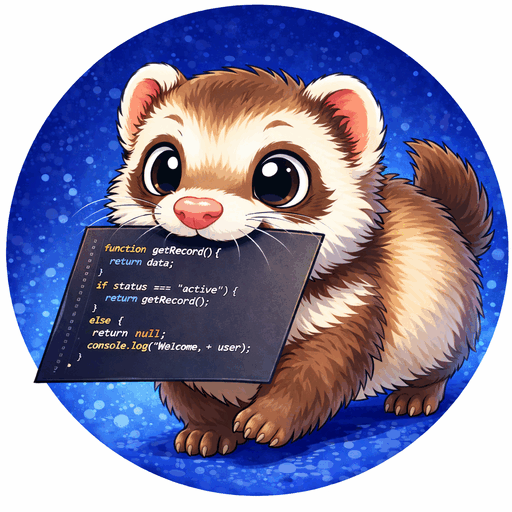

# codira

`codira` is a repository-local indexing and context retrieval tool for
agent-assisted development. It gives coding agents a compact, deterministic
map of the repository so they can spend fewer tokens rediscovering files,
symbols, call paths, and docstring issues.

It builds a SQLite index inside the target repository and currently provides:

- exact symbol lookup
- docstring auditing
- deterministic local semantic embeddings
- deterministic context generation for natural-language queries
- static call-edge and callable-reference inspection
- plugin discovery for official and third-party analyzers/backends

Used next to a coding agent, `codira` is most useful before broad exploration:
index once, ask a focused question, then hand the agent a small context pack
instead of asking it to scan the whole tree.

## Documentation scope

The repository documentation covers:

- how to install and use the current tool locally
- how contributors should validate changes
- the small set of repository-owned helper scripts
- the branch and ADR workflow used for repository governance
- a baseline architecture description for the accepted ADR-004 migration
- the active ADR trail, listed dynamically as new ADR files are added

## Current architecture status

The current implementation is SQLite-backed and registry-driven.

It now supports:

- one active backend per repository index
- multiple analyzers in one indexing run
- deterministic indexing for tracked `*.py`, `*.c`, and `*.h` files

The accepted future architectural direction is documented in
[`ADR-004`](adr/ADR-004-pluggable-backends-migration-plan.md).

The current architecture and migration state are documented under
[`Architecture`](architecture/index.md).
